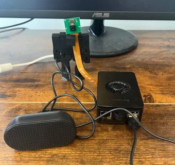
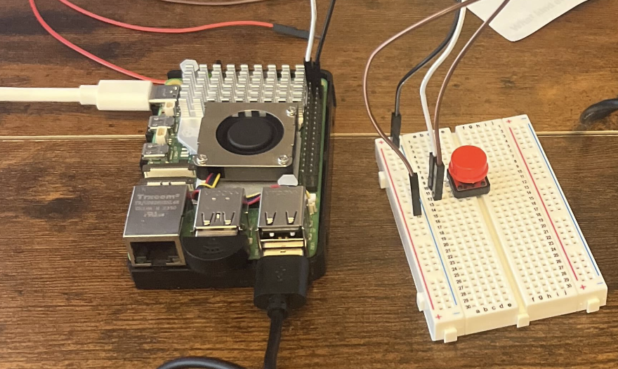

# Pi-C.A.R.D




## Table of Contents

-   [Introduction](#introduction)
-   [Usage](#usage)
-   [Hardware](#hardware)
-   [Setup](#setup)
-   [Roadmap](#roadmap)

**Note**: This project is still under development, and camera functionality is not yet fully implemented.

Due to llama cpp no longer supporting vision models, the camera functionality has been temporarily removed.

## Introduction

Pi-Card is an AI powered assistant running entirely on a Raspberry Pi. It is capable of doing what a standard LLM (like ChatGPT) can do in a conversational setting.
In addition, if there is a camera equipped, you can also ask Pi-card to take a photo, describe what it sees, and then ask questions about that image.

### Why Pi-card?

Raspberry **Pi** - **C**amera **A**udio **R**ecognition **D**evice.


Please submit an issue or pull request if you can think of a better way to force this acronym.

### How does it work?

Pi-Card runs on your Raspberry Pi.

**With a wake word**. Once the `main.py`, the system will listen for your wake word. Once your wake word has been said, you are officially in a conversation. Within this conversation you do not need to constantly repeat the wake word. The system will continue to listen for your commands until you say something like "stop", "exit", or "goodbye". More information on this / customization can be found in the `config.py` file.

**With a button**. If you can get your hands on a breadboard, some wires, and a button, using a button to to handle the conversation is a much smoother (in my opinion) way to interact. This is done by pressing the button, and then speaking your command. The button is a simple GPIO button, and can be set up by following the instructions in the `main_button.py` file.

The chatbot has a configurable memory of the conversation, meaning if you want the assistant to repeat something it said, or elaborate on a previous topic, you can do so. For quicker responses, you can set the memory to a smaller number in the `config.py` file.

### How useful is it?

The system is designed to be a fun project that can be a _somewhat_ helpful AI assistant. Since everything is done locally, it will not be as capable, or as fast, as cloud based systems. However, in the past year significant strides have already been made in small LLM models, and it's likely that this will only continue to improve, meaning so too will this project!

### Why isn't this an app?

The main reason for this is that I wanted to create a voice assistant that is completely offline and doesn't require any internet connection. This is mostly because I wanted to ensure that the user's privacy is protected and that the user's data is not being sent to any third party servers. I also want to know how capable voice assistants can be in a completely offline setting.

## Usage

After downloading the repository, installing the requirements, and following the other setup instructions, you can run the main program by running the following command:

```bash
python main.py
```

or

```bash
python main_button.py
```

Once the program is running, you can start a conversation with the assistant by saying the wake word. The default wake words are "raspberry", "barry", "razbear" (aka things that the transcription might have accidentally picked up), but you can change this in the `config.py` file. If the button version is in place, you can press the button to start a conversation, or interrupt the assistant at any time.

## Setup

### Software

To keep this system as fast and lean as possible, we use cpp implementations of the audio transcription. This is done with the wonderful library [whisper.cpp](https://github.com/ggerganov/whisper.cpp).

Please clone the repository wherever you like, and add its path to the `config.py` file.

Once cloned, please follow the setup instructions to get the models running. Some pointers are given below:

#### Tools

To make pi-card a bit more like a real assistant, there are a couple tools it has access to. These are done through [tool-bert](https://huggingface.co/nkasmanoff/tool-bert), a fine-tuned version of BERT deciding when to access external info. More info on how to make a version of this can be found [here](https://github.com/nkasmanoff/tool-bert)

The model is easy to install, but to enable tool access, take a look at .env.example file for context on what keys and secrets are necessary.

For whisper.cpp, you will need to follow the quick-start guide in the [README](https://github.com/ggerganov/whisper.cpp?tab=readme-ov-file#quick-start).

Since this project is depending on openly available models, depending on the ones used, the limitations of this assistant will be the same as limitations of the models.

### Hardware

The hardware setup is quite simple. You will need a Raspberry Pi 5 Model B, a USB microphone, and a speaker.

The USB microphone and speaker can be plugged into the Raspberry Pi's USB ports. The camera can be connected to the camera port on the Raspberry Pi.

I used the following hardware for my setup:

-   [Raspberry Pi 5 Kit](https://www.amazon.com/dp/B0CRSNCJ6Y?psc=1&ref=ppx_yo2ov_dt_b_product_details)
-   [USB Microphone](https://www.amazon.com/dp/B087PTH787?psc=1&ref=ppx_yo2ov_dt_b_product_details)
-   [Speaker](https://www.amazon.com/dp/B075M7FHM1?ref=ppx_yo2ov_dt_b_product_details&th=1)
-   [Camera](https://www.amazon.com/dp/B012V1HEP4?ref=ppx_yo2ov_dt_b_product_details&th=1)
-   [Camera Connector](https://www.amazon.com/dp/B0716TB6X3?psc=1&ref=ppx_yo2ov_dt_b_product_details)
-   [Button](https://www.amazon.com/DIYables-Button-Arduino-ESP8266-Raspberry/dp/B0BXKN4TY6)
-   [Breadboard](https://www.amazon.com/dp/B09VKYLYN7?psc=1&ref=ppx_yo2ov_dt_b_product_details)

Please note Pi 5's have a new camera port, hence the new camera connector. At the same time, while this project is focused on making this work on a Raspberry Pi 5, it should
work on other devices as well.

The camera connector is optional, but if you want to use the camera functionality, you will need to purchase one.

For setting up the GPIO button, I found the first couple minutes of [this tutorial](https://youtu.be/IHvtJvgM_eQ?si=VZzhElu5yYTt7zcV) great.

Feel free to use your own, this is what worked for me!

## Roadmap

Coming soon, but I plan to add notes here on things currently implemented, and what can be done in the future. Some quick notes on it are below. I've started to make a notion board to keep track of things, but it's not complete yet. Check it out [here](https://marble-laugh-dd5.notion.site/14195743cced80229c3cddfd0cd5a750?v=a673ae0424b445d9983b71774a943b0f).

-   [x] Basic conversation capabilities
-   [ ] Camera capabilities
-   [x] Benchmark response times
-   [x] Test overclocking
-   [x] Figure out how to speed up whisper times
-   [x] Add ability to interrupt assistant, and ask new question
-   [x] Use a custom tuned model for the assistant
-   [ ] Improved tutorials & videos
-   [ ] Improve external service function model (tool-bert)
-   [x] Test when connected to a portable power source
-   [ ] Create optional model generation using entropix
-   [ ] Dockerize repo for testing on more devices
-   [ ] Test in other languages
-   [ ] Add more external services
